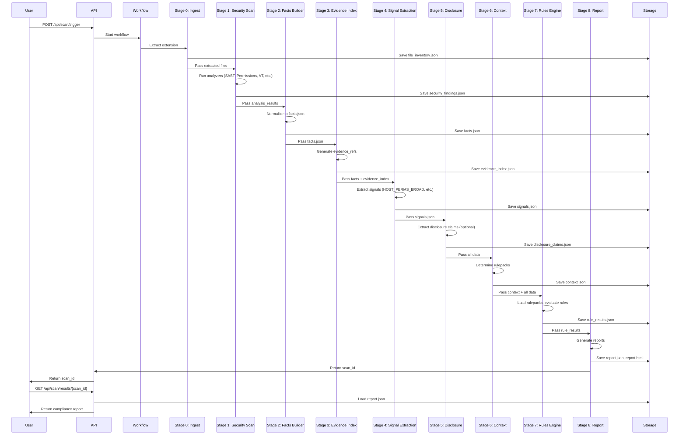

# Compliance Scanner - Architecture & Implementation Guide

<p align="center">
  <strong>Evidence-Grade Compliance Analysis for Chrome Extensions</strong>
</p>

<p align="center">
  <a href="#overview">Overview</a> •
  <a href="#architecture">Architecture</a> •
  <a href="#data-flow">Data Flow</a> •
  <a href="#data-contracts">Data Contracts</a> •
  <a href="#rule-condition-dsl">Rule Condition DSL</a> •
  <a href="#implementation">Implementation</a> •
  <a href="#api-reference">API Reference</a>
</p>

---

## Overview

The **Compliance Scanner** is a deterministic, evidence-based compliance analysis system that transforms security findings into regulatory compliance verdicts. It evaluates Chrome extensions against policy rulepacks (e.g., Chrome Web Store Limited Use Policy, India DPDP Act) and produces **PASS/FAIL/NEEDS_REVIEW** verdicts with full evidence chains.

### Key Features

### Build-by-Next-Week Checklist: 

1. **Schemas locked** (`schemas.py`) + directory contract (`/scans/{scan_id}/`)
2. **Manual citations.yaml** + two rulepacks (`CWS_LIMITED_USE.yaml`, `DPDP_RISK_INDICATORS.yaml`)
3. **Stage 2–4**: Facts → Evidence → Signals
4. **Stage 7**: RulesEngine + Condition DSL (PASS/FAIL/NEEDS_REVIEW)
5. **Stage 8**: report.json + report.html
6. **Bundle export endpoint** + (optional) citations resolver endpoint


- **Deterministic Verdicts**: Rule-based evaluation produces consistent PASS/FAIL/NEEDS_REVIEW outcomes
- **Evidence-First Design**: Every finding links to code snippets, manifest excerpts, and network traces
- **Chain-of-Custody**: Artifact hash → file hash → line ranges → provenance tracking
- **Multi-Policy Support**: Evaluates against multiple rulepacks (CWS, DPDP, etc.)
- **Disclosure Mismatch Detection**: Compares observed behavior vs. stated privacy claims
- **Enforcement-Ready**: Export bundles include all evidence, citations, and hashes

### Philosophy

1. **Minimal v0 Contracts**: Lock schemas that support 10-15 rules, expand only when needed
2. **Keep Existing Code**: Security analysis (Project Atlas) remains unchanged
3. **Scan Artifact Directory**: Every scan creates `/scans/{scan_id}/` with all JSONs
4. **Reuse Endpoints**: Change return format, don't add new endpoints (except bundle export)
5. **Dataflow is "Nice to Have"**: 2-3 high-confidence correlations, not full taint analysis

---

## Architecture

### Two-Pipeline Split

```
┌─────────────────────────────────────────────────────────────┐
│  PIPELINE A: Policy Authoring (Offline, Manual for MVP)   │
│  ────────────────────────────────────────────────────────  │
│  Input:  Manual citations.yaml creation (1 hour task)      │
│  Output: citations.yaml + rulepack YAML files               │
└─────────────────────────────────────────────────────────────┘

┌─────────────────────────────────────────────────────────────┐
│  PIPELINE B: Extension Scanning (Online, Automated)        │
│  ────────────────────────────────────────────────────────  │
│  Input:  Web Store URL / CRX / ZIP + Rulepacks             │
│  Output: Compliance matrix + Evidence + Enforcement bundle  │
└─────────────────────────────────────────────────────────────┘
```

**MVP Decision**: Pipeline A is **manual** (citations.yaml + rulepack YAML files). No PDF parsing needed.

### System Architecture Diagram

```mermaid
graph TB
    subgraph "User Interface"
        UI[Web UI / CLI / API]
    end
    
    subgraph "API Layer"
        API[FastAPI Endpoints]
    end
    
    subgraph "Workflow Orchestration"
        WG[LangGraph Workflow]
    end
    
    subgraph "Security Analysis Pipeline (Existing)"
        S0[Stage 0: Ingest + Extract]
        S1[Stage 1: Project Atlas Scan]
    end
    
    subgraph "Compliance Pipeline (New)"
        S2[Stage 2: Facts Builder]
        S3[Stage 3: Evidence Index Builder]
        S4[Stage 4: Signal Extraction]
        S5[Stage 5: Disclosure Extractor]
        S6[Stage 6: Context Builder]
        S7[Stage 7: Rules Engine]
        S8[Stage 8: Report Generator]
    end
    
    subgraph "Data Storage"
        SD[Scan Artifact Directory<br/>/scans/{scan_id}/]
        DB[(SQLite Database)]
    end
    
    subgraph "Policy Authoring (Manual)"
        RP[Rulepack YAML Files]
        CIT[Citations YAML]
    end
    
    UI --> API
    API --> WG
    WG --> S0
    S0 --> S1
    S1 --> S2
    S2 --> S3
    S3 --> S4
    S4 --> S5
    S5 --> S6
    S6 --> S7
    S7 --> S8
    S8 --> SD
    S8 --> DB
    S7 --> RP
    S7 --> CIT
    S8 --> API
```

---

## API Endpoint Flow

```mermaid
graph LR
    subgraph "Client"
        WEB[Web UI]
        CLI[CLI]
    end
    
    subgraph "API Endpoints"
        TRIGGER[POST /api/scan/trigger]
        UPLOAD[POST /api/scan/upload]
        STATUS[GET /api/scan/status/{id}]
        RESULTS[GET /api/scan/results/{id}]
        REPORT[GET /api/scan/report/{id}]
        BUNDLE[GET /api/scan/enforcement_bundle/{id}]
    end
    
    subgraph "Backend"
        WORKFLOW[LangGraph Workflow]
        STORAGE[Scan Directory]
        DB[(Database)]
    end
    
    WEB --> TRIGGER
    WEB --> UPLOAD
    CLI --> TRIGGER
    CLI --> UPLOAD
    
    TRIGGER --> WORKFLOW
    UPLOAD --> WORKFLOW
    
    WEB --> STATUS
    CLI --> STATUS
    STATUS --> DB
    
    WEB --> RESULTS
    CLI --> RESULTS
    RESULTS --> STORAGE
    
    WEB --> REPORT
    REPORT --> STORAGE
    
    WEB --> BUNDLE
    BUNDLE --> STORAGE
    
    WORKFLOW --> STORAGE
    WORKFLOW --> DB
    
    style TRIGGER fill:#e1f5ff
    style RESULTS fill:#e8f5e9
    style BUNDLE fill:#fff4e1
```

---

## Data Flow

### Complete Pipeline Flow



### Stage-by-Stage Data Transformation

```
Input: Web Store URL / CRX / ZIP
  ↓
[Stage 0] Ingest + Extract
  → scan_id (UUID)
  → artifact_hash (SHA256)
  → file_inventory.json
  ↓
[Stage 1] Project Atlas Scan (Existing)
  → security_findings.json
  → analysis_results (permissions, SAST, VT, entropy, webstore)
  ↓
[Stage 2] Facts Builder
  → facts.json (canonical contract)
  → Normalizes: manifest, files, security findings, endpoints
  ↓
[Stage 3] Evidence Index Builder
  → evidence_index.json
  → Centralized evidence storage with evidence_ref IDs
  → Links: file_path, sha256, line ranges, snippets, provenance
  ↓
[Stage 4] Signal Extraction
  → signals.json
  → Typed signals: HOST_PERMS_BROAD, SENSITIVE_API, ENDPOINT_FOUND, DATAFLOW_TRACE
  → Confidence scores (0.0-1.0)
  → Links to evidence_refs
  ↓
[Stage 5] Disclosure Extractor (Optional)
  → disclosure_claims.json (or {} if skipped)
  → Extracted from Web Store listing
  → data_categories, purposes, third_parties, retention, user_rights
  ↓
[Stage 6] Context Builder
  → context.json
  → Determines applicable rulepacks (CWS, DPDP, etc.)
  → regions_in_scope, domain_categories
  ↓
[Stage 7] Rules Engine
  → rule_results.json
  → PASS/FAIL/NEEDS_REVIEW verdicts per rule
  → Links to evidence_refs and citations
  → Evaluates: facts + signals + disclosure + context
  ↓
[Stage 8] Report Generator
  → report.json (full structured report)
  → report.html (HTML template)
  → enforcement_bundle.zip (export endpoint)
```

---

## Data Contracts

### Scan Artifact Directory Structure

**Canonical Location**: `/scans/{scan_id}/` (relative to project root)

Every scan creates a directory with all intermediate outputs:

```
/scans/{scan_id}/
  ├── artifact.zip              # Optional: original extension file
  ├── file_inventory.json       # Stage 0 output
  ├── security_findings.json     # Stage 1 output (existing format)
  ├── facts.json                 # Stage 2 output
  ├── evidence_index.json        # Stage 3 output
  ├── signals.json               # Stage 4 output
  ├── context.json               # Stage 6 output
  ├── disclosure_claims.json     # Stage 5 output ({} if skipped)
  ├── rule_results.json          # Stage 7 output
  ├── report.json                # Stage 8 output (full report)
  └── report.html                # Stage 8 output (HTML template)
```

### facts.json (Stage 2 Output)

**Purpose**: Canonical contract between security analysis and compliance pipeline

```json
{
  "scan_id": "550e8400-e29b-41d4-a716-446655440000",
  "artifact_hash": "sha256:abc123...",
  "source": "webstore",
  "extension": {
    "id": "abcdefghijklmnopqrstuvwxyz",
    "name": "Example Extension",
    "version": "1.0.0"
  },
  "manifest": {
    "manifest_version": 3,
    "permissions": ["storage", "tabs"],
    "host_permissions": ["<all_urls>"],
    "externally_connectable": {
      "matches": ["*://*.example.com/*"]
    },
    "content_scripts": [
      {
        "matches": ["*://*/*"],
        "js": ["content.js"]
      }
    ]
  },
  "files": [
    {
      "path": "manifest.json",
      "sha256": "def456...",
      "size": 1024,
      "is_minified": false
    }
  ],
  "security": {
    "semgrep_findings": [
      {
        "rule_id": "banking.form_hijack.submit_intercept",
        "path": "src/bg.js",
        "start_line": 120,
        "end_line": 132,
        "message": "Form submit interception detected"
      }
    ],
    "entropy_flags": [
      {
        "path": "data.bin",
        "entropy": 7.8,
        "reason": "high_entropy"
      }
    ],
    "virustotal_summary": {
      "score": 5,
      "vendors_flagged": 2
    }
  },
  "endpoints": {
    "static": [
      "https://api.example.com/track",
      "https://analytics.google.com"
    ]
  }
}
```

### evidence_index.json (Stage 3 Output)

**Purpose**: Centralized evidence storage with chain-of-custody

```json
{
  "evidence_index": {
    "ev_001": {
      "evidence_id": "ev_001",
      "type": "code",
      "artifact": {
        "file_path": "src/bg.js",
        "sha256": "abc123...",
        "line_start": 120,
        "line_end": 132
      },
      "snippet": "fetch('https://api.example.com/track', { method: 'POST', body: data })",
      "provenance": {
        "source": "webstore",
        "artifact_hash": "sha256:...",
        "collected_at": "2026-01-22T10:00:00Z"
      },
      "redactions": ["token", "email"]
    },
    "ev_002": {
      "evidence_id": "ev_002",
      "type": "manifest",
      "artifact": {
        "file_path": "manifest.json",
        "sha256": "def456...",
        "line_start": 5,
        "line_end": 7
      },
      "snippet": "\"host_permissions\": [\"<all_urls>\"]",
      "provenance": {
        "source": "webstore",
        "artifact_hash": "sha256:...",
        "collected_at": "2026-01-22T10:00:00Z"
      }
    }
  }
}
```

### signals.json (Stage 4 Output)

**Purpose**: Typed signals with confidence scores

**MVP Signal Types** (exactly 4 types for MVP):
- `HOST_PERMS_BROAD`: Wildcard host permissions detected
- `SENSITIVE_API`: Risky API calls (eval, MediaRecorder, storage)
- `ENDPOINT_FOUND`: Network endpoints extracted
- `DATAFLOW_TRACE`: Source→sink correlation (high confidence, 2-3 traces max for MVP)

```json
{
  "signals": [
    {
      "signal_id": "sig_001",
      "type": "HOST_PERMS_BROAD",
      "confidence": 0.8,
      "evidence_refs": ["ev_002"],
      "metadata": {
        "permission": "<all_urls>"
      }
    },
    {
      "signal_id": "sig_002",
      "type": "SENSITIVE_API",
      "confidence": 0.8,
      "evidence_refs": ["ev_003"],
      "metadata": {
        "api": "chrome.storage.local.get"
      }
    },
    {
      "signal_id": "sig_003",
      "type": "ENDPOINT_FOUND",
      "confidence": 0.7,
      "evidence_refs": ["ev_001"],
      "metadata": {
        "endpoint": "https://api.example.com/track",
        "method": "POST"
      }
    },
    {
      "signal_id": "sig_004",
      "type": "DATAFLOW_TRACE",
      "confidence": 0.95,
      "evidence_refs": ["ev_003", "ev_001"],
      "metadata": {
        "source": "chrome.storage.local.get",
        "sink": "fetch",
        "endpoint": "https://api.example.com/track"
      }
    }
  ]
}
```

**Confidence Levels**:
- `0.95`: Confirmed dataflow trace (source + sink + endpoint in proximity)
- `0.80`: Explicit endpoint + sensitive permission
- `0.60`: Endpoint + storage + broad permissions (no dataflow)
- `0.30`: Weak heuristic

### disclosure_claims.json (Stage 5 Output - Optional)

**Purpose**: Structured claims from Web Store listing

**Important**: If Stage 5 is skipped (optional), this file must contain an empty object `{}`, not `null` or missing.

```json
{
  "disclosure_claims": {
    "data_categories": ["email", "location"],
    "purposes": ["analytics"],
    "third_parties": ["Google Analytics"],
    "retention": "indefinite",
    "user_rights": ["access"],
    "policy_url": "https://...",
    "policy_hash": "sha256:...",
    "extracted_at": "2026-01-22T10:00:00Z"
  }
}
```

**When Skipped**: File contains `{"disclosure_claims": {}}` (empty object). Rules checking `disclosure_claims.data_categories is empty` will evaluate to `true`.

### context.json (Stage 6 Output)

**Purpose**: Determine which rulepacks apply

```json
{
  "context": {
    "regions_in_scope": ["IN", "US"],
    "rulepacks": ["CWS_LIMITED_USE", "DPDP_RISK_INDICATORS"],
    "domain_categories": ["general"],
    "cross_border_risk": false
  }
}
```

**MVP**: Default to CWS + DPDP starter rulepacks (no complex region detection).

### rule_results.json (Stage 7 Output)

**Purpose**: Deterministic compliance verdicts

```json
{
  "rule_results": [
    {
      "rule_id": "CWS_LIMITED_USE::R1",
      "rulepack": "CWS_LIMITED_USE",
      "verdict": "NEEDS_REVIEW",
      "confidence": 0.95,
      "evidence_refs": ["ev_002"],
      "citations": ["CWS_LIMITED_USE::SECTION_3"],
      "explanation": "Extension requests wildcard host permissions (<all_urls>) which requires justification per CWS Limited Use Policy"
    },
    {
      "rule_id": "CWS_LIMITED_USE::R2",
      "rulepack": "CWS_LIMITED_USE",
      "verdict": "FAIL",
      "confidence": 0.90,
      "evidence_refs": ["ev_001", "ev_003"],
      "citations": ["CWS_LIMITED_USE::SECTION_5"],
      "explanation": "Extension collects PII (chrome.storage.local.get) and exfiltrates to external endpoint (https://api.example.com/track) without disclosure"
    },
    {
      "rule_id": "DPDP_RISK::R1",
      "rulepack": "DPDP_RISK_INDICATORS",
      "verdict": "NEEDS_REVIEW",
      "confidence": 0.85,
      "evidence_refs": ["ev_001", "ev_004"],
      "citations": ["IN_DPDP_ACT_2023::S5"],
      "explanation": "Potential cross-border data transfer detected (endpoint: api.example.com, non-IN domain)"
    }
  ]
}
```

**Verdicts**:
- `PASS`: Rule satisfied, no violation
- `FAIL`: Clear violation detected
- `NEEDS_REVIEW`: Ambiguous case requiring human review

### report.json (Stage 8 Output)

**Purpose**: Complete structured report

```json
{
  "scan_id": "550e8400-e29b-41d4-a716-446655440000",
  "timestamp": "2026-01-22T10:00:00Z",
  "extension": {
    "id": "abcdefghijklmnopqrstuvwxyz",
    "name": "Example Extension",
    "version": "1.0.0"
  },
  "facts": { /* facts.json content */ },
  "evidence_index": { /* evidence_index.json content */ },
  "signals": { /* signals.json content */ },
  "context": { /* context.json content */ },
  "disclosure_claims": { /* disclosure_claims.json content or {} */ },
  "rule_results": { /* rule_results.json content */ },
  "summary": {
    "total_rules_evaluated": 15,
    "pass_count": 8,
    "fail_count": 2,
    "needs_review_count": 5,
    "rulepacks_applied": ["CWS_LIMITED_USE", "DPDP_RISK_INDICATORS"]
  }
}
```

---

## Rule Condition DSL

**Purpose**: Define the exact grammar and semantics for rule conditions to ensure deterministic evaluation.

### Supported Operators

| Operator | Syntax | Description | Example |
|----------|--------|-------------|---------|
| **Equality** | `==`, `!=` | Value comparison | `manifest.manifest_version == 3` |
| **Contains** | `contains` | Check if array/string contains value | `manifest.permissions contains "storage"` |
| **Not Contains** | `not contains` | Check if array/string does not contain value | `manifest.permissions not contains "tabs"` |
| **Is Empty** | `is empty` | Check if array/object/string is empty | `disclosure_claims.data_categories is empty` |
| **Is Not Empty** | `is not empty` | Check if array/object/string is not empty | `signals is not empty` |
| **Logical AND** | `AND` | Both conditions must be true | `condition1 AND condition2` |
| **Logical OR** | `OR` | Either condition must be true | `condition1 OR condition2` |
| **Logical NOT** | `NOT` | Negate condition | `NOT (condition)` |
| **Type Check** | `type="..."` | Check signal type (for signals array) | `signals contains type="SENSITIVE_API"` |
| **Nested Access** | `.` | Access nested object properties | `manifest.host_permissions` |
| **Array Access** | `[index]` | Access array element by index | `manifest.content_scripts[0].matches` |

### Operator Precedence

1. Parentheses `()` (highest precedence)
2. `NOT`
3. `AND`
4. `OR` (lowest precedence)

### Condition Evaluation Rules

1. **Missing Fields**: If a field is missing or `null`, treat as:
   - Arrays: `[]` (empty array)
   - Objects: `{}` (empty object)
   - Strings: `""` (empty string)
   - Numbers: `0`
   - Booleans: `false`

2. **Type Coercion**: 
   - Numbers and strings are compared as-is (no implicit conversion)
   - `contains` works on arrays and strings
   - `is empty` works on arrays, objects, and strings

3. **Signal Type Matching**: 
   - `signals contains type="SENSITIVE_API"` checks if any signal in the `signals` array has `type == "SENSITIVE_API"`
   - Returns `true` if at least one signal matches

4. **Array Contains**: 
   - `array contains value` returns `true` if `value` is in `array`
   - For strings: `string contains substring` returns `true` if substring exists in string

### Examples

```yaml
# Example 1: Simple permission check
condition: |
  manifest.permissions contains "storage"

# Example 2: Wildcard host permissions
condition: |
  manifest.host_permissions contains "<all_urls>" OR
  manifest.host_permissions contains "*://*/*"

# Example 3: Signal type check
condition: |
  signals contains type="SENSITIVE_API" AND
  signals contains type="ENDPOINT_FOUND"

# Example 4: Disclosure check with empty handling
condition: |
  signals contains type="SENSITIVE_API" AND
  signals contains type="ENDPOINT_FOUND" AND
  disclosure_claims.data_categories is empty

# Example 5: Complex nested condition
condition: |
  (manifest.host_permissions contains "<all_urls>" OR
   manifest.host_permissions contains "*://*/*") AND
  signals contains type="ENDPOINT_FOUND" AND
  NOT (disclosure_claims.data_categories is not empty)

# Example 6: Dataflow trace check
condition: |
  signals contains type="DATAFLOW_TRACE" AND
  endpoints.static is not empty

# Example 7: Manifest version check
condition: |
  manifest.manifest_version == 3 AND
  manifest.permissions contains "tabs"
```

### Edge Cases

1. **Empty disclosure_claims**: If Stage 5 is skipped, `disclosure_claims = {}`. Rules checking `disclosure_claims.data_categories is empty` will evaluate to `true` (because accessing `.data_categories` on `{}` returns missing/null, which is treated as empty).

2. **Missing signals**: If no signals are found, `signals = []`. `signals contains type="SENSITIVE_API"` returns `false`.

3. **Nested missing fields**: `manifest.content_scripts[0].matches` returns empty array if `content_scripts` is missing or empty.

4. **String vs Array**: `manifest.permissions` is an array, so use `contains`. `manifest.name` is a string, so use `==` or `contains` for substring matching.

### Implementation Notes

- Use a simple recursive descent parser or a library like `pyparsing`
- Evaluate left-to-right with operator precedence
- Short-circuit evaluation for `AND`/`OR` (stop early if result is known)
- Cache parsed conditions for performance
- Validate conditions at rulepack load time (fail fast)


---

### FAIL vs NEEDS_REVIEW Standard (Rule-writing guideline)

Use these standards consistently across rulepacks:

- **FAIL**: You have **strong, directly attributable evidence** (e.g., explicit endpoint + sensitive permission + correlated code path,
  or a correlation trace) *and* the rule’s conditions clearly match.
- **NEEDS_REVIEW**: You have a plausible risk indicator (broad host perms, endpoints present, risky APIs) but **cannot prove behavior**
  or intent from static evidence alone.
- **PASS**: Condition is not met.

This keeps false positives low and makes the output defensible.


---

## Implementation

### File Structure

**Canonical Path**: All compliance code goes under `src/project_atlas/compliance/`

```
src/project_atlas/
├── compliance/                    # NEW: Compliance pipeline
│   ├── __init__.py
│   ├── schemas.py                 # Minimal v0 TypedDict schemas
│   ├── scan_artifact.py           # Scan artifact directory manager
│   ├── facts_builder.py           # Stage 2: FactsBuilder
│   ├── evidence_index_builder.py  # Stage 3: EvidenceIndexBuilder
│   ├── signal_extractor_legacy.py # Stage 4: SignalExtractorLegacy
│   ├── disclosure_extractor.py    # Stage 5: DisclosureExtractor
│   ├── context_builder.py         # Stage 6: ContextBuilder
│   ├── rules_engine.py            # Stage 7: RulesEngine
│   ├── report_generator_compliance.py  # Stage 8: ReportGenerator
│   ├── citations.yaml             # Manual citations (10-20 entries)
│   └── rulepacks/                 # Rulepack YAML files
│       ├── CWS_LIMITED_USE.yaml
│       └── DPDP_RISK_INDICATORS.yaml
├── workflow/
│   ├── nodes.py                   # MODIFY: Add compliance nodes
│   ├── graph.py                   # MODIFY: Integrate compliance pipeline
│   └── state.py                   # MODIFY: Add compliance state fields
└── api/
    └── main.py                    # MODIFY: Update endpoints, add bundle export
```

### Build Order (Recommended Implementation Sequence)

1. **Lock Schemas** (`schemas.py`, `scan_artifact.py`)
2. **Citations & Rulepacks** (`citations.yaml`, `rulepacks/*.yaml`)
3. **Facts Builder** (`facts_builder.py`)
4. **Evidence Index Builder** (`evidence_index_builder.py`)
5. **Signal Extractor** (`signal_extractor_legacy.py`)
6. **Context Builder** (`context_builder.py`)
7. **Rules Engine** (`rules_engine.py`) - **Must implement Rule Condition DSL**
8. **Report Generator** (`report_generator_compliance.py`)
9. **Workflow Integration** (`nodes.py`, `graph.py`)
10. **API Updates** (`main.py`)

### Rulepack Format (YAML)

**Location**: `src/project_atlas/compliance/rulepacks/`

```yaml
rulepack_id: "CWS_LIMITED_USE"
version: "1.0.0"
name: "Chrome Web Store Limited Use Policy"
description: "Rules for CWS Limited Use / Permissions & data handling"

rules:
  - rule_id: "CWS_LIMITED_USE::R1"
    name: "Excessive Host Permissions"
    description: "Wildcard host permissions require justification"
    condition: |
      manifest.host_permissions contains "<all_urls>" OR
      manifest.host_permissions contains "*://*/*"
    verdict: "NEEDS_REVIEW"
    citations: ["CWS_LIMITED_USE::SECTION_3"]
    
  - rule_id: "CWS_LIMITED_USE::R2"
    name: "Undisclosed Data Collection"
    description: "PII collection without disclosure"
    condition: |
      signals contains type="SENSITIVE_API" AND
      signals contains type="ENDPOINT_FOUND" AND
      disclosure_claims.data_categories is empty
    verdict: "FAIL"
    citations: ["CWS_LIMITED_USE::SECTION_5"]
```

**MVP Rulepacks**:
- `CWS_LIMITED_USE.yaml` (10-ish rules)
- `DPDP_RISK_INDICATORS.yaml` (5-ish rules)

### Citations Format (YAML)

**Location**: `src/project_atlas/compliance/citations.yaml`

```yaml
citations:
  - citation_id: "CWS_LIMITED_USE::SECTION_3"
    title: "Chrome Web Store Limited Use Policy - Section 3"
    short_snippet: "Extensions must request only the minimum permissions necessary..."
    source_url: "https://developer.chrome.com/docs/webstore/program-policies/limited-use/"
    retrieved_at: "2026-01-22T10:00:00Z"
    
  - citation_id: "IN_DPDP_ACT_2023::S5"
    title: "DPDP Act 2023 - Section 5"
    short_snippet: "Every data fiduciary shall process personal data only for lawful purposes..."
    source_url: "https://..."
    retrieved_at: "2026-01-22T10:00:00Z"
```

**MVP**: Manual creation (1 hour task), 10-20 citations total.

---

## API Reference

### Modified Endpoints

#### `GET /api/scan/results/{scan_id}`

**Changed**: Now returns structured `report.json` instead of raw analysis results.

**Response**:
```json
{
  "scan_id": "550e8400-e29b-41d4-a716-446655440000",
  "timestamp": "2026-01-22T10:00:00Z",
  "extension": { /* ... */ },
  "facts": { /* ... */ },
  "evidence_index": { /* ... */ },
  "signals": { /* ... */ },
  "context": { /* ... */ },
  "disclosure_claims": { /* ... */ },
  "rule_results": { /* ... */ },
  "summary": { /* ... */ }
}
```

#### `GET /api/scan/report/{scan_id}`

**Changed**: Now returns HTML report instead of PDF.

**Response**: HTML document with compliance matrix, evidence drilldown, and citation links.

### New Endpoints

#### `GET /api/scan/enforcement_bundle/{scan_id}`

**Purpose**: Export complete enforcement bundle (ZIP file).

**Response**: 
- Content-Type: `application/zip`
- Filename: `enforcement_bundle_{scan_id}.zip`

**Bundle Contents**:
```
enforcement_bundle_{scan_id}.zip
  ├── facts.json
  ├── evidence_index.json
  ├── signals.json
  ├── context.json
  ├── disclosure_claims.json (if available, or {} if skipped)
  ├── rule_results.json
  ├── report.json
  ├── artifact_hash.txt
  └── citations/
      └── {citation_id}.txt (minimal citations)
```

#### `GET /api/citations/{citation_id}` (Optional)

**Purpose**: Resolve a `citation_id` into a human-readable policy snippet for UI drilldown.

**Response**:
```json
{
  "citation_id": "CWS_LIMITED_USE::SECTION_3",
  "title": "Chrome Web Store Limited Use Policy - Section 3",
  "short_snippet": "Extensions must request only the minimum permissions necessary...",
  "source_url": "https://developer.chrome.com/docs/webstore/program-policies/limited-use/",
  "retrieved_at": "2026-01-22T10:00:00Z"
}
```

### Existing Endpoints (Unchanged)

- `POST /api/scan/trigger` - Trigger scan from URL
- `POST /api/scan/upload` - Upload and scan file
- `GET /api/scan/status/{scan_id}` - Get scan status
- `GET /api/scan/files/{scan_id}` - List extracted files
- `GET /api/scan/file/{scan_id}/{path}` - Get file content

---

## Key Architecture Decisions

### 1. Keep Existing Security Analysis

**Decision**: Don't refactor existing security analyzers. Make them emit signals, then build new `RulesEngine`.

**Rationale**: 
- Security analysis works as-is
- Compliance layer is separate concern
- Faster implementation (no breaking changes)

### 2. Minimal v0 Schemas

**Decision**: Lock minimal schemas that support 10-15 rules. Expand only when rules demand it.

**Rationale**:
- Avoid over-engineering
- Faster to implement
- Easy to extend later

### 3. Scan Artifact Directory

**Decision**: Every scan creates `/scans/{scan_id}/` with all JSONs.

**Rationale**:
- Pipeline is debuggable (all stages visible)
- Easy to export enforcement bundle
- Clear data flow

### 4. Reuse Endpoints

**Decision**: Change return format, don't add new endpoints (except bundle export).

**Rationale**:
- Minimal API changes
- Backward compatible (frontend can adapt)
- Faster implementation

### 5. Dataflow (MVP = minimal correlations, not full taint)

**Decision**: Ship **2–3 high-confidence correlation traces** (source→sink heuristics) for the MVP.
Do **not** build a full-blown taint engine in week 1.

**Rationale**:
- Full taint analysis is complex and can introduce licensing/tooling risk
- A *small* number of strong traces is enough to produce at least a few **defensible FAILs**
- Architecture remains swappable for a future “real dataflow” upgrade

**Implementation note**: model these as `DATAFLOW_TRACE` signals with confidence ~0.95 when you can show:
source (storage/DOM/form/cookie) → transform (optional) → sink (fetch/xhr/sendBeacon/ws).

### 6. Manual Citations

**Decision**: No PDF parsing for MVP, just `citations.yaml`.

**Rationale**:
- 1 hour task vs. weeks of PDF parsing
- Sufficient for MVP demo
- Can automate later

### 7. Default Rulepacks

**Decision**: CWS + DPDP starter, no complex region detection.

**Rationale**:
- Covers most use cases
- Simple to implement
- Can add region detection later

### 8. Disclosure Stage Behavior

**Decision**: If Stage 5 (Disclosure Extractor) is skipped, `disclosure_claims.json` must contain `{"disclosure_claims": {}}` (empty object), not `null` or missing.

**Rationale**:
- Prevents crashes when rules check `disclosure_claims.data_categories is empty`
- Consistent behavior: missing = empty object
- Rules can safely check `is empty` without null checks

---

## MVP Definition (Clean Finish Line)

**MVP Complete When**:
- ✅ `facts.json` built from Project Atlas output
- ✅ `evidence_index.json` generated and referenced everywhere
- ✅ `signals.json` with confidence + evidence refs (exactly 4 signal types)
- ✅ `rule_results.json` PASS/FAIL/NEEDS_REVIEW from YAML rulepacks
- ✅ Rule Condition DSL implemented and tested
- ✅ `report.html` that drills: Rule → Evidence → Citation ID
- ✅ One export bundle zip endpoint
- ✅ Disclosure stage handles skipped case (empty object)

**Everything Else is Phase 2**:
- Full taint analysis (dataflow is "nice to have")
- Privacy policy fetching (listing extraction only for MVP)
- Complex region detection (default to CWS + DPDP)
- Byte offsets in evidence (line ranges are enough)
- Additional signal types beyond the 4 MVP types

---

## Licensing Notes

### VirusTotal
- **Note**: Verify VirusTotal API terms of service before commercial use
- **Decision**: Use for prototype/demo only
- **Alternative**: URLhaus (prototype-friendly, simple API)

### Semgrep
- **Note**: Verify Semgrep licensing requirements for commercial use
- **Decision**: Use for prototype/demo, keep architecture swappable
- **Alternative**: Can replace with custom AST/rule engine later

---

## Testing Strategy

### Unit Tests
- Each stage (2-8) should have unit tests
- Test schema validation
- Test rule evaluation logic (Rule Condition DSL)
- Test edge cases (empty disclosure_claims, missing fields, etc.)

### Integration Tests
- End-to-end pipeline test
- Test with sample extensions
- Verify all JSONs are generated correctly
- Test disclosure stage skipped case

### Test Data
- Create test extensions with known violations
- Verify verdicts match expectations
- Test edge cases (empty manifests, no findings, etc.)
- Test Rule Condition DSL with all operators

---

## Quick Reference

### Signal Types (MVP - Exactly 4)

| Type | Description | Confidence |
|------|-------------|------------|
| `HOST_PERMS_BROAD` | Wildcard host permissions | 0.80 |
| `SENSITIVE_API` | Risky API calls (eval, storage) | 0.80 |
| `ENDPOINT_FOUND` | Network endpoints extracted | 0.70 |
| `DATAFLOW_TRACE` | Source→sink correlation | 0.95 |

### Verdicts

| Verdict | Meaning | Use Case |
|---------|---------|----------|
| `PASS` | Rule satisfied, no violation | Extension complies |
| `FAIL` | Clear violation detected | Extension violates policy |
| `NEEDS_REVIEW` | Ambiguous case | Requires human review |

### Implementation Priority

**Phase 1: Lock Data Contracts (Week 1)**
1. Define `schemas.py` (TypedDict contracts)
2. Create `scan_artifact.py` (directory manager)
3. Create `citations.yaml` (10-20 manual entries)
4. Create rulepack YAML files (CWS + DPDP)
5. Build `FactsBuilder` (Stage 2)
6. Build `EvidenceIndexBuilder` (Stage 3)

**Phase 2: Signal & Rules Layer (Week 2)**
7. Refactor to `SignalExtractorLegacy` (Stage 4)
8. Build `ContextBuilder` (Stage 6)
9. Build `RulesEngine` (Stage 7) - **Implement Rule Condition DSL**
10. Integrate into workflow (LangGraph nodes)

**Phase 3: Reporting & Polish (Week 3)**
11. Build `ReportGenerator` (Stage 8)
12. Add HTML report template
13. Add enforcement bundle export endpoint
14. End-to-end testing

---

## Future Enhancements (Phase 2)

1. **Full Taint Analysis**: Replace correlation-based dataflow with real taint traces
2. **Privacy Policy Fetching**: Automate policy URL extraction and parsing
3. **Region Detection**: Automatic region detection based on extension metadata
4. **Byte Offsets**: Add byte-level offsets to evidence (currently line-only)
5. **PDF Policy Parsing**: Automate citation extraction from PDFs
6. **Rulepack Marketplace**: Allow users to upload custom rulepacks
7. **Batch Processing**: Scan multiple extensions in parallel
8. **Compliance Trends**: Track compliance over time for extensions
9. **Additional Signal Types**: Expand beyond the 4 MVP types

---

## Questions & Answers

**Q: Should we refactor existing security analyzers or build new pipeline?**  
✅ **Build new pipeline; keep existing as signal source. Refactor later.**

**Q: What's the exact facts.json schema?**  
✅ **Lock the minimal v0 contract. Don't expand until rules demand it.**

**Q: Should we implement Disclosure Extractor for MVP?**  
✅ **Do Web Store listing extraction only for demo (fast + high impact). Policy URL fetch can be Phase 1.5.**

**Q: What rulepacks should be included?**  
✅ **Start with CWS Limited Use (10-ish rules) + DPDP risk indicators (5-ish rules). Keep it small and high-confidence.**

**Q: What happens if disclosure stage is skipped?**  
✅ **File contains `{"disclosure_claims": {}}` (empty object). Rules checking `disclosure_claims.data_categories is empty` evaluate to `true`.**

**Q: What's the Rule Condition DSL?**  
✅ **See "Rule Condition DSL" section above. Must be implemented exactly as specified for deterministic behavior.**

---

<p align="center">
  <sub>This architecture is designed for evidence-grade compliance analysis with deterministic verdicts and full chain-of-custody tracking.</sub>
</p>
